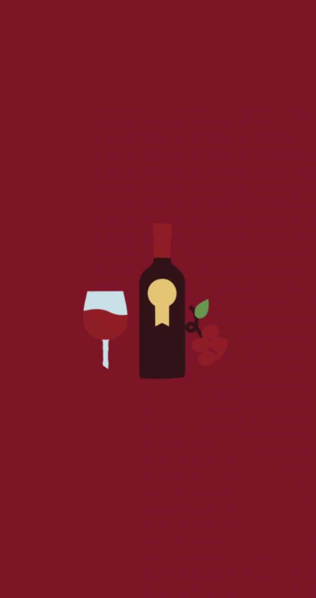
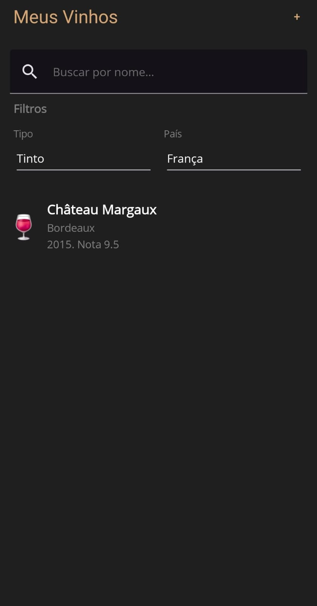
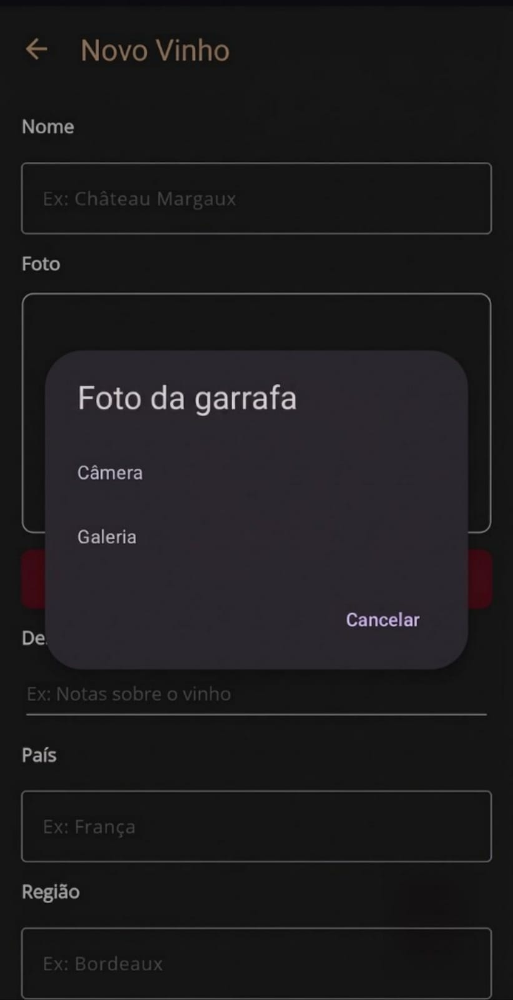
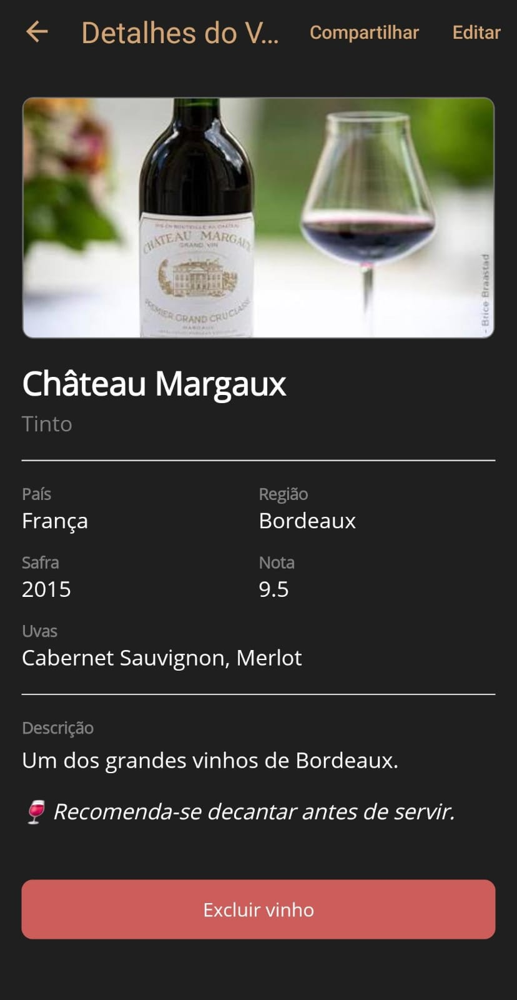

# WineCellar

Um catálogo pessoal para organizar vinhos e guardar experiências de degustação — construído para os momentos de vinho às sextas com meu pai, registrando as melhores marcas, uvas e regiões que já experimentamos.

App Android desenvolvido em .NET MAUI, com foco em aprendizado didático de arquitetura mobile.

  
  

  
  

## Roadmap

- [x] **Fase 1** — Estrutura inicial, navegação e CRUD (Code Behind)
- [x] **Fase 2** — Persistência local com SQLite
- [x] **Fase 3** — Seleção e armazenamento da foto da garrafa
- [x] **Fase 4** — Compartilhamento dos dados do vinho (API `Share` do .NET MAUI)
- [x] **Fase 5** — Migração para MVVM com CommunityToolkit.Mvvm
- [ ] **Fase 6** — Busca, filtros e ordenação
- [ ] **Fase 7** — Melhorias de UI/UX: temas claro/escuro, transições e animações

### Icon Credits
<a href="https://www.magnific.com/icon/wine_5825336#fromView=search&page=1&position=6&uuid=c5ecd1d6-5754-4a5b-a1dd-25369bad0b83">Icon by small.smiles</a>